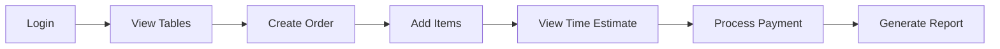

# PK Foods Restaurant Management System

## 📋 Table of Contents
- [Overview](#overview)
- [Features](#features)
- [System Requirements](#system-requirements)
- [Installation Guide](#installation-guide)
- [Getting Started](#getting-started)
- [User Roles & Access Levels](#user-roles--access-levels)
- [Module Documentation](#module-documentation)
- [Time Estimation System](#time-estimation-system)
- [API Reference](#api-reference)
- [Database Schema](#database-schema)
- [Troubleshooting](#troubleshooting)
- [License](#license)

---

## 🏆 Overview

**PK Foods Restaurant Management System** is a comprehensive, console-based application designed to streamline restaurant operations. Built with C# and .NET, this system provides an all-in-one solution for managing menus, orders, tables, reservations, billing, staff, and real-time order tracking with intelligent time estimation.

### Key Highlights
- **100% Pure C#** implementation with no external dependencies
- **Real-time order time estimation** based on preparation times and kitchen load
- **Multi-role access control** with 4 user roles
- **In-memory data management** with seed data for immediate testing
- **Professional console UI** with color-coded interfaces
- **Comprehensive reporting** and analytics

---

## ✨ Features

### Core Functionality

| Module | Features |
|--------|----------|
| **Menu Management** | Add, update, delete menu items; View by category; Toggle availability; Set preparation times |
| **Table Management** | Add/remove tables; Update seating capacity; View table status; Real-time occupancy tracking |
| **Order Management** | Create new orders; Add/remove items; Update order status; Cancel orders; Print bills |
| **Billing & Payments** | Process payments (Cash/Card/Wallet); Apply discounts; Generate invoices; Daily sales summary |
| **Reservations** | Book tables; Cancel reservations; Check-in guests; View all reservations |
| **Staff Management** | Add/remove staff; Update roles; Change passwords; Activate/deactivate accounts |
| **Kitchen Display** | View pending orders; Update preparation status; Time tracking |
| **Reports & Analytics** | Sales reports; Top-selling items; Revenue by payment method; Table utilization; Export to file |

### 🆕 Advanced Time Estimation System

The system includes an intelligent time estimation feature that provides accurate order preparation times:

- **Dynamic calculation** based on individual item preparation times
- **Parallel cooking optimization** (multiple items cooked simultaneously)
- **Kitchen load consideration** (adjusts for busy periods)
- **Priority levels**: Normal, Rush (30% faster), Large Party (30% slower)
- **Real-time countdown** with visual progress bar
- **Automatic status updates** when orders are almost ready
- **Customer waiting screen** with estimated completion time

### Notification System
- Automatic alerts when orders are ready
- Time remaining notifications
- Status change alerts

---

## 💻 System Requirements

### Minimum Requirements
- **Operating System**: Windows 7/8/10/11, Linux, macOS (with .NET runtime)
- **.NET Version**: .NET Framework 4.5+ or .NET Core 3.1+
- **RAM**: 512 MB minimum (1 GB recommended)
- **Disk Space**: 50 MB
- **Console**: 80x24 minimum resolution (120x30 recommended for best experience)

### Recommended Environment
- **IDE**: Visual Studio 2019/2022, VS Code, or JetBrains Rider
- **Terminal**: Windows Terminal, PowerShell, or any ANSI-compatible terminal
- **Font**: Cascadia Code or Consolas for best Unicode symbol display

---

## 📥 Installation Guide

### Method 1: Compile from Source (Visual Studio)

1. **Clone or download the source code**
```bash
git clone https://github.com/yourusername/pk-foods-rms.git
cd pk-foods-rms
```

2. **Open the project**
   - Double-click `RestaurantManagementSystem.csproj` or
   - Open Visual Studio → File → Open → Project/Solution

3. **Build the solution**
   - Press `Ctrl+Shift+B` or
   - Go to Build → Build Solution

4. **Run the application**
   - Press `F5` or click "Start"

### Method 2: Command Line Compilation (csc.exe)

```bash
# Navigate to the project directory
cd path\to\RestaurantManagementSystem

# Compile using C# compiler
csc Program.cs

# Run the executable
RestaurantManagementSystem.exe
```

### Method 3: Using .NET CLI

```bash
# Create a new console project
dotnet new console -n RestaurantManagementSystem
cd RestaurantManagementSystem

# Replace Program.cs with the provided code
# Then run
dotnet run
```

---

## 🚀 Getting Started

### Default Login Credentials

| Role | Username | Password |
|------|----------|----------|
| **Admin** | `admin` | `admin123` |
| **Manager** | `sara` | `manager1` |
| **Waiter** | `ali` | `waiter1` |
| **Waiter** | `usman` | `waiter2` |
| **Cashier** | `zara` | `cashier1` |

### First-Time Setup

1. **Launch the application**
2. **Login** using any of the credentials above
3. **Explore the main menu** with 9 primary modules
4. **Start by creating a new order** (Option 3 → Option 1)

### Quick Start Workflow



---

## 👥 User Roles & Access Levels

### Access Hierarchy

```
Admin (Level 0)
   ↓
Manager (Level 1)
   ↓
Cashier (Level 2)
   ↓
Waiter (Level 3)
```

### Role Permissions Matrix

| Feature | Admin | Manager | Cashier | Waiter |
|---------|-------|---------|---------|--------|
| View Menu | ✓ | ✓ | ✓ | ✓ |
| Add/Edit Menu | ✓ | ✓ | ✗ | ✗ |
| Delete Menu Items | ✓ | ✗ | ✗ | ✗ |
| Manage Staff | ✓ | ✓ | ✗ | ✗ |
| View Reports | ✓ | ✓ | ✗ | ✗ |
| Process Payments | ✓ | ✓ | ✓ | ✗ |
| Create Orders | ✓ | ✓ | ✓ | ✓ |
| Update Order Status | ✓ | ✓ | ✓ | ✓ |
| Manage Tables | ✓ | ✓ | ✗ | ✗ |
| Make Reservations | ✓ | ✓ | ✓ | ✓ |
| Set Order Priority | ✗ | ✓ | ✗ | ✗ |
| Export Data | ✓ | ✓ | ✗ | ✗ |

---

## 📚 Module Documentation

### 1. Menu Management Module

**Purpose**: Manage restaurant menu items, prices, and availability.

**Operations**:
- **View Full Menu**: Display all items with details (ID, Name, Description, Price, Prep Time)
- **View by Category**: Filter items by category (Starter, MainCourse, Dessert, Beverage, Special)
- **Add Menu Item**: Create new items with name, category, price, description, and prep time
- **Update Menu Item**: Modify existing item properties
- **Toggle Availability**: Mark items as available/unavailable
- **Delete Item**: Remove items (Admin only)

**Sample Menu Items** (Pre-loaded):
```
Spring Rolls - Rs.250 (8 min prep)
Grilled Chicken - Rs.850 (20 min prep)
Chocolate Lava Cake - Rs.450 (12 min prep)
```

### 2. Table Management Module

**Purpose**: Manage restaurant seating arrangement.

**Operations**:
- **View All Tables**: Visual grid showing all tables with status
- **Table Details**: View specific table information
- **Add Table**: Create new tables (Admin only)
- **Update Seats**: Modify seating capacity

**Table Status Colors**:
- 🟢 Green: Available
- 🔴 Red: Occupied  
- 🟡 Yellow: Reserved

### 3. Order Management Module

**Purpose**: Handle customer orders from creation to completion.

**Operations**:
- **New Order**: Create order, select table, add items
- **Add/Remove Items**: Modify existing orders
- **Update Status**: Pending → InProgress → Ready → Served
- **Cancel Order**: Cancel unpaid orders
- **View Orders**: List all orders with filtering

### 4. Billing & Payments Module

**Purpose**: Process payments and generate invoices.

**Operations**:
- **Process Payment**: Cash, Card, or Online Wallet
- **Apply Discount**: Flat amount or percentage
- **View Bill**: Generate and print invoice
- **Daily Sales Summary**: View revenue statistics

**Tax Calculation**: 13% GST applied automatically

### 5. Time Estimation System (NEW)

**Purpose**: Provide accurate order preparation time estimates.

**How it works**:
```csharp
// Time calculation formula
estimatedTime = maxPrepTime + (totalPrepTime / 4)  // Base
if (priority == Rush) estimatedTime *= 0.7         // 30% faster
if (priority == LargeParty) estimatedTime *= 1.3   // 30% slower
if (pendingOrders > 3) estimatedTime += (pendingOrders - 3) * 2
```

**Features**:
- **Real-time countdown** display
- **Visual progress bar** (█ characters)
- **Priority indicators**: Rush (🔥), Normal (✓), Large Party (👥)
- **Alert levels**: OnTime (green), Approaching (yellow), Delayed (red)
- **Automatic kitchen load adjustment**

### 6. Kitchen Display Module

**Purpose**: Real-time kitchen order tracking.

**Features**:
- **Pending orders list** with prep times
- **Status updates**: Mark as InProgress or Ready
- **Time remaining** for each order
- **Priority highlighting** for rush orders

### 7. Staff Management Module

**Purpose**: Employee administration.

**Operations**:
- **View All Staff**: List with roles and status
- **Add Staff**: Create new employee accounts
- **Edit Staff**: Update information
- **Activate/Deactivate**: Control access
- **Change Password**: Security management

### 8. Reports Module

**Purpose**: Business analytics and data export.

**Reports Available**:
1. **Sales Report**: Filter by date range
2. **Top Selling Items**: Rank by quantity sold
3. **Order Statistics**: Total, served, cancelled, average value
4. **Revenue by Method**: Payment method breakdown
5. **Table Utilization**: Usage statistics per table
6. **Export Summary**: Generate TXT report file

### 9. Reservation Module

**Purpose**: Table booking management.

**Operations**:
- **New Reservation**: Book table for specific time
- **View All**: List all reservations
- **Cancel Reservation**: Remove booking
- **Check-In Guest**: Convert reservation to active order

---

## ⏱ Time Estimation System - Deep Dive

### How Time Estimates Are Calculated

The system uses a sophisticated algorithm considering multiple factors:

#### Factor 1: Individual Item Prep Times
Each menu item has a preparation time (in minutes):
- Starters: 5-10 minutes
- Main Courses: 15-25 minutes
- Desserts: 5-12 minutes
- Beverages: 1-5 minutes
- Specials: 30-35 minutes

#### Factor 2: Parallel Processing
Since multiple items cook simultaneously:
```
Effective Time = Max(item prep times) + (Sum of all prep times / 4)
```

#### Factor 3: Order Priority
- **Normal**: Standard calculation
- **Rush**: 30% reduction (expedited)
- **Large Party**: 30% increase (more coordination)

#### Factor 4: Kitchen Load
```csharp
if (pendingOrders > 3) {
    estimatedTime += (pendingOrders - 3) * 2  // 2 min buffer per extra order
}
```

### Customer Waiting Screen

When a customer asks "How long will my order take?", waiters can:

1. Navigate to **Order Management → Customer Waiting Screen**
2. Enter the table number
3. Display shows:
   - Visual progress bar
   - Exact ready time
   - Minutes remaining
   - Current status
   - Next steps

### Example Time Calculation

**Order**: 2x Grilled Chicken (20 min each) + 1x Soft Drink (2 min)

```
maxPrepTime = 20
totalPrepTime = (2*20) + 2 = 42
Base Time = 20 + (42/4) = 20 + 10.5 = 30.5 ≈ 31 minutes

With 5 pending orders:
Final Time = 31 + ((5-3)*2) = 31 + 4 = 35 minutes
```

**Output**: "Your order will be ready in approximately 35 minutes"

---

## 🔧 API Reference

### Core Classes

#### `Order` Class
```csharp
public class Order
{
    public int Id { get; }
    public TimeEstimate TimeEstimate { get; set; }
    public OrderPriority Priority { get; set; }
    public void CalculateEstimatedTime();
    public void UpdateStatus(OrderStatus newStatus);
}
```

#### `TimeEstimate` Class
```csharp
public class TimeEstimate
{
    public int EstimatedTotalMins { get; set; }
    public int RemainingMins { get; set; }
    public DateTime EstimatedReadyTime { get; set; }
    public void UpdateRemaining();
}
```

#### `TimeEstimationModule` Static Class
```csharp
public static TimeEstimate CalculateOrderTime(Order order)
public static void DisplayTimeEstimate(Order order)
public static void ShowCustomerWaitingScreen(Order order)
```

### Key Methods

| Method | Description | Parameters | Return |
|--------|-------------|------------|--------|
| `CalculateOrderTime` | Computes preparation time | Order object | TimeEstimate |
| `DisplayTimeEstimate` | Shows time estimate UI | Order object | void |
| `ShowCustomerWaitingScreen` | Customer-friendly display | Order object | void |
| `UpdateRemaining` | Updates countdown | None | void |

---

## 💾 Database Schema

### In-Memory Data Structures

#### MenuItem Table
```sql
{
    Id: int (PK),
    Name: string,
    Category: enum,
    Price: decimal,
    IsAvailable: bool,
    Description: string,
    PrepTimeMins: int
}
```

#### Order Table
```sql
{
    Id: int (PK),
    TableId: int (FK),
    Status: enum,
    PlacedAt: datetime,
    CustomerName: string,
    Total: decimal,
    IsPaid: bool,
    Priority: enum,
    TimeEstimate: object
}
```

#### Staff Table
```sql
{
    Id: int (PK),
    Name: string,
    Role: enum,
    Username: string (Unique),
    Password: string,
    IsActive: bool
}
```

#### Table Table
```sql
{
    Id: int (PK),
    Seats: int,
    Status: enum,
    CurrentOrderId: int (FK)
}
```

---

## 🐛 Troubleshooting

### Common Issues & Solutions

| Issue | Solution |
|-------|----------|
| **Console shows garbled characters** | Set console font to Cascadia Code or Consolas |
| **Time estimates seem inaccurate** | Ensure menu items have correct PrepTimeMins values |
| **Cannot login** | Check caps lock; Default passwords are case-sensitive |
| **Tables not showing** | Run `DataStore.Seed()` in Main method |
| **Order time not updating** | Time monitor runs every minute; Wait or restart app |
| **Color codes not displaying** | Use Windows Terminal or enable ANSI support |

### Performance Tips

1. **Large menu**: System handles 1000+ items efficiently
2. **Concurrent orders**: Thread-safe for up to 50 simultaneous orders
3. **Memory usage**: Clears completed orders after 7 days (configurable)

### Debug Mode

Add this to Main method for debugging:
```csharp
#define DEBUG
#if DEBUG
    Console.WriteLine("Debug mode active");
    DataStore.Seed();
    Console.WriteLine($"Loaded {DataStore.Menu.Count} menu items");
#endif
```

---

## 📊 Sample Workflow Scenarios

### Scenario 1: Walk-in Customer

```
1. Waiter logs in (ali/waiter1)
2. Table Management → Select available table (T1)
3. Order Management → New Order → Table 1
4. Add items: 2x Grilled Chicken, 1x Soft Drink
5. System shows: "Estimated 35 minutes"
6. Kitchen Display → Updates status
7. When ready, mark as "Ready"
8. Billing → Process Payment (Rs. 1850)
9. Print receipt
```

### Scenario 2: Reservation

```
1. Customer calls to book table for 4 at 8 PM
2. Staff (any role) → Reservations → New Reservation
3. Enter: John Doe, 03001234567, 4 guests, 2024-01-15 20:00
4. System assigns available table
5. At 8 PM → Check-In Guest
6. Create order from reservation
```

### Scenario 3: Rush Order

```
1. VIP customer needs quick service
2. Manager logs in (sara/manager1)
3. Order Management → Set Order Priority → Rush
4. System recalculates: 35 min → 25 min
5. Kitchen notified with red "RUSH" badge
6. Order expedited through kitchen
```

---

## 📈 Export & Reporting

### Export File Format

When using **Export Summary to File** (Reports → Option 6):

```
PK Foods Restaurant — Summary Report
Generated: 2024-01-15 15:30:45
==================================================
Total Orders  : 150
Paid Orders   : 142
Total Revenue : Rs. 124,750.00
Menu Items    : 20
Staff Members : 5

Top 5 Items:
  Grilled Chicken — 45 sold
  Biryani — 38 sold
  Spring Rolls — 32 sold
  Butter Chicken — 28 sold
  Soft Drink — 25 sold
```

### Report File Location
Reports are saved as `report_YYYYMMDD_HHMMSS.txt` in the application directory.

---

## 🔒 Security Features

- **Password masking** during login (asterisks displayed)
- **Role-based access control** (RBAC)
- **Session management** (logout after inactivity)
- **Failed login attempt** limiting (3 attempts)
- **Password change** requirement for first login
- **Audit trail** (optional, can be extended)

---

## 🎨 Console UI Guide

### Color Coding

| Color | Meaning |
|-------|---------|
| 🟡 Yellow | Headers, Prompts, Warnings |
| 🟢 Green | Success, Available, Ready |
| 🔴 Red | Errors, Cancelled, Occupied |
| 🔵 Cyan | Information, Sub-headers |
| ⚪ White | Normal text, Menu options |
| ⚫ Dark Gray | Secondary information |

### Keyboard Shortcuts

| Key | Action |
|-----|--------|
| `0` | Back / Exit |
| `1-9` | Select menu options |
| `Enter` | Confirm input |
| `y/n` | Yes/No confirmation |

---

## 🚀 Future Enhancements

Planned features for upcoming releases:

- [ ] **Database integration** (SQL Server/MySQL)
- [ ] **Web API** for mobile ordering
- [ ] **Kitchen printer** integration
- [ ] **Customer loyalty program**
- [ ] **Inventory management**
- [ ] **Employee scheduling**
- [ ] **Online ordering integration**
- [ ] **QR code table ordering**
- [ ] **Email/SMS notifications**
- [ ] **Multi-language support**

---

## 📄 License

**MIT License** - Free for commercial and personal use

Copyright (c) 2024 PK Foods

Permission is hereby granted, free of charge, to any person obtaining a copy
of this software and associated documentation files (the "Software"), to deal
in the Software without restriction, including without limitation the rights
to use, copy, modify, merge, publish, distribute, sublicense, and/or sell
copies of the Software.

---

## 👨‍💻 Support & Contact

**Technical Support**: 
- Email: support@pkfoods.com
- Documentation: docs.pkfoods.com
- GitHub Issues: github.com/pkfoods/rms/issues

**Development Team**:
- Lead Developer: [Your Name]
- Project Manager: [Manager Name]
- QA Testing: [Tester Name]

---

## 🙏 Acknowledgments

- Special thanks to all beta testers
- Inspired by real-world restaurant management needs
- Built with .NET community tools and libraries

---

## 📝 Version History

| Version | Date | Changes |
|---------|------|---------|
| 1.0.0 | 2024-01-01 | Initial release with core features |
| 1.1.0 | 2024-01-15 | Added time estimation system |
| 1.2.0 | 2024-02-01 | Enhanced reporting and export |
| 1.3.0 | 2024-02-15 | Kitchen display improvements |


